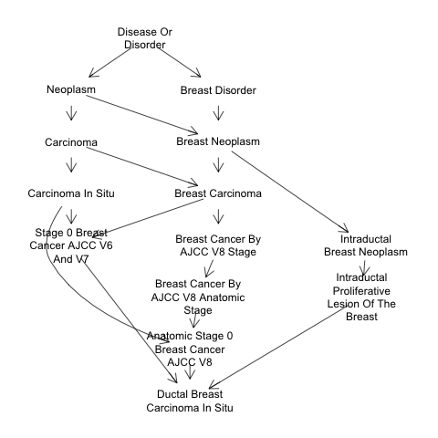

```{r setup, include=FALSE}
library(tufte)
# invalidate cache when the tufte version changes
knitr::opts_chunk$set(tidy = FALSE, cache.extra = packageVersion('tufte'))
options(htmltools.dir.version = FALSE)
suppressPackageStartupMessages({
library(rhdf5client)
library(BiocStyle)
library(restfulSE)
library(restfulSEData)
library(ggplot2)
library(BiocOncoTK)
library(ontoProc)
library(SRAdbV2)
set.seed(1234)
})
```

# Introduction

`r newthought("Strategic thinking about computing")` for
cancer genomics
involves a panoply of concepts evolving
in an unstable technological domain.^[One snapshot of current approaches 
can be found at Broad's CGCA site
https://www.broadinstitute.org/cancer/cancer-genome-computational-analysis]
In this computable document,
we lay out a series of concepts and examples
around which our basic developmental
strategy for cloud-oriented Bioconductor:Cancer
can be understood.
**All demonstrations are based on the "devel branch" of Bioconductor in R 3.5.**

# Basic map of the situation

We will use the term "architecture" in conjunction
with the following broad categories of relevance
to computing for cancer genomics.

- **Conceptual architecture:** How are formal ontologies,
APIs, and concrete data tables used together to
efficiently identify key biological and
therapeutic processes in cancer?

- **Data architecture:** How are cohorts, trials, experiments, samples,
quantifications, and annotations best represented for 
efficient 
solutions to problems arising in computational biology of cancer?
Are cloud-scale approaches to managing and interrogating
"big data" effectively usable by enough researchers?

- **Analysis architecture:**  How can advances in conceptual
and data architecture help to accelerate the development
of compelling new interpretations of existing and new
experiments in cancer genomics?

In what follows we aim to get very concrete about the
ways in which the Bioconductor:Cancer project delivers advances
in these areas.

# Conceptual architecture

## Ontology

Results of experiments and trials in human cancer
produce information in many domains.  Systematic synthesis
of relevant information depends on harmonization of vocabularies,
and progress is incomplete.  The ontoProc package simplifies
usage of key ontologies in the Open Biological Ontologies
Foundry.  We consider the oncotree vocabulary produced at 
Sloan-Kettering.^[http://oncotree.mskcc.org/#/home?tab=news shows
that this is an evolving resource, as one might expect.  What
we work with is a slight variation created using NCIT terms
that coincide with oncotree terms, as distributed at http://purl.obolibrary.org/obo/ncit/ncit-oncotree.obo]

```{r lkot}
library(ontoProc)
otr = getOncotreeOnto()
grep("Breast", otr$name, value=TRUE)[1:4]
```

Code like this leads to the observation that there are
`r length(grep("Breast", otr$name))` terms involving
`Breast` in the vocabulary
^[A view of relationships among 10 terms related to "Breast".
{ width=70% }].  Relationships among these
terms are encoded in `otr`.  The collection of ontologies
usable in this way can be gleaned from
```{r lklklk}
grep("Onto", ls("package:ontoProc"), value=TRUE)
```
Ideally, we would use ChEBI, EFO, and Cellosaurus in
integrative analyses of pharmacogenomic experiments 
that account for structural and functional
relationships among chemical entities and
genetic and functional relationships among
cell types.  Additional integration with clinical and
molecular observations of tumors in TCGA would be fostered
by adoption of conventions on genomic and clinical vocabularies.
We will discuss this situation below.

## APIs

Effectiveness of computational research depends upon reliable
interaction among independently developed components.
The API concept helps to promote durable and 
correct interaction.  

To develop the capacity for Bioconductor
users to survey all sequencing experiments housed
in NCBI SRA, S. Davis has created the SRAdbV2 package.
Metadata that are continuously developed at SRA are
transformed for "serverless" interrogation using
Elasticsearch.  Thus
```{r lksra}
library(SRAdbV2)
oidx = Omicidx$new()
allhrec = oidx$search(q="sample_taxon_id: 9606")
allhrec$count()
```
gives the number of records involving human samples.  A selection
of fields that can be interrogated to acquire accession
numbers for experiments of interest is
```{r lklkaaa}
lk = allhrec$scroll()
sample(mm <- names(lk$yield()), size=5)
```
There are `r length(mm)` fields whose semantics must
be known to enable effective searching.


What is a good approach to reducing redundant computation,
treating new inferences and their uncertainties as data

conceptual architecture
 - ontologies
 - apis (SRAdbV2, HSDS)
 - tables and fields (TCGA in bigquery)

data architecture
 - MultiAssayExperiment/singleCellExperiment
 - MAE with DelayedArray back end
 - BigQuery and HSDS as back ends
 - extensibility, example of MSISensor binding to BQ

analysis architecture
 - interactive visualization
 - classical hypothesis testing with enhanced FDR control (e.g., IHW)
 - network methods AMARETTO, LIONESS ...
 - learning transfer - kipoi?

next steps

The following code can be used to work with the Recount2 ^[Collado-Torres, Leonardo, Abhinav Nellore, Kai Kammers, Shannon E. Ellis, Margaret A. Taub, Kasper D. Hansen, Andrew E. Jaffe, Ben Langmead, and Jeffrey T. Leek. 2017. _Reproducible RNA-
seq analysis using recount2._ Nature Biotechnology 35 (4): 319–21. doi:10.1038/nbt.3838.] version of the GTEx RNA-seq tissue expression data.

```{r dorec2,eval=TRUE,echo=FALSE,results="hide",cache=TRUE}
suppressMessages({
library(restfulSE)
gt = gtexTiss()
})
```
```{r dodo,eval=FALSE}
library(restfulSE)
gt = gtexTiss()
gt
```
```{r doec,echo=FALSE}
cat("class: RangedSummarizedExperiment 
dim: 58037 9662 
metadata(0):
assays(1): recount
rownames(58037): ENSG00000000003.14 ENSG00000000005.5 ...
  ENSG00000283698.1 ENSG00000283699.1
rowData names(3): gene_id bp_length symbol
colnames(9662): SRR660824 SRR2166176 ... SRR612239 SRR615898
colData names(82): project sample ... title characteristics"
)
```
```{r lkta,eval=FALSE}
table(gt$smts)
```
```{r lkts,echo=FALSE}
cat("
                 Adipose Tissue   Adrenal Gland         Bladder           Blood 
              5             620             159              11             595 
   Blood Vessel     Bone Marrow           Brain          Breast    Cervix Uteri 
            750             102            1409             218              11 
...")
```
A quick visual check of center labeling and normalization success:
```{r chkgap}
gind = which(unlist(rowData(gt)$symbol) == "GAPDH")
mydf = data.frame(logGAPDH=log(as.numeric(assay(gt[gind,]))+1),
  center=gt$smcenter)
library(ggplot2)
ggplot(mydf, aes(x=center, y=logGAPDH, colour=center)) + geom_boxplot()
```

Other resources conveyed via this HDF5 Server include
the 10x Genomics 1.3 million neuron dataset (use `restfulSE::se1.3M()`),
CONQUER-based quantifications^[Soneson, Charlotte, and Mark D. Robinson. 2018. _Bias, robustness
and scalability in single-cell differential expression analysis._ Nature Methods 15 (4). Nature Publishing Group: 255–61. doi:10.1038/nmeth.4612.] of single-cell RNA-seq studies by
Patel et al.^[Patel, Anoop P, Itay Tirosh, John J Trombetta, Alex K Shalek, M Shawn, Hiroaki Wakimoto, Daniel P Cahill, et al. 2014. _Single-cell RNA-seq highlights intratumoral heterogeneity in primary glioblastoma._ Science 344 (6190): 1396–1401. doi:10.1126/science.1254257.] and Darmanis et al.^[Darmanis, Spyros, Steven A. Sloan, Derek Croote, Marco Mignardi, Sophia Chernikova, Peyman Samghababi, Ye Zhang, et al. 2017. _Single-Cell RNA-Seq Analysis of Infiltrating Neoplastic Cells at
the Migrating Front of Human Glioblastoma._ Cell Reports 21 (5). ElsevierCompany.: 1399–1410. doi:10.1016/j.celrep.2017.10.030.]
and the "tabula muris"^[Quake, Stephen R., Tony Wyss-Coray, and Spyros Darmanis. 2017. _Transcriptomic characterization of 20 organs and tissues from mouse at single cell resolution creates a Tabula Muris._ bioRxiv, 237446. doi:10.1101/237446.] quantifications distributed at the
Human Cell Atlas.  Check with pamphlet authors for more details.

# HDF Cloud for DelayedArrays

HDF Cloud is newer and more scalable than HDF5 Server,
but is not yet open source.  We are experimenting with
HDF Cloud thanks to support from John Readey of the HDF Group.
You can start working with the 1.3 million neuron data through
the DelayedArray interface as follows.  We illustrate summation
of selected columns.
```{r lkdm,eval=FALSE}
dm10x = H5S_Array(URL_hsds(), 
  "/shared/bioconductor/tenx_full.h5",
  "newassay001")
dim(dm10x)
colSums(dm10x[,1:6])
```
The result of `HSDS_Matrix` can be used as the assay component
of a SummarizedExperiment.

To *write* data to this instance of HDF Cloud, you will need 
privileges.  Given
any HDF5 dataset, the utilities for porting to the cloud are part
of the h5pyd python package.

# Google BigQuery for MultiAssayExperiments derived from the PanCancer Atlas

The restfulSE and BiocOntoTK packages help authenticated users to
derive SummarizedExperiment instances for TCGA and PanCancer-Atlas
with Google BigQuery back ends, as managed by the Institute for
Systems Biology.

```{r dobrca,eval=FALSE}
library(BiocOncoTK)
bq = pancan_BQ() # authenticate
brca_mir = pancan_SE(bq) # defaults are BRCA micro-RNA assays
brca_mir
```
```{r resbr,echo=FALSE}
cat("class: SummarizedExperiment 
dim: 743 1068 
metadata(0):
assays(1): assay
rownames(743): hsa-miR-9-3p hsa-miR-191-3p ... hsa-miR-516a-5p
  hsa-miR-892b
rowData names(0):
colnames(1068): TCGA-3C-AAAU TCGA-3C-AALJ ... TCGA-Z7-A8R6 TCGA-Z7-A8R5
colData names(746): bcr_patient_uuid bcr_patient_barcode ...
  bilirubin_upper_limit days_to_last_known_alive")
```

The BiocOncoTK vignette indicates how to construct MultiAssayExperiment^[Ramos, Marcel, Lucas Schiffer, Angela Re, Rimsha Azhar, Azfar Basunia, Rodriguez Cabrera, Tiffany Chan, Philip Chapman, Sean Davis, and David Gomez-cabrero. 2017. _Software for the integration of multi-omics experiments in Bioconductor._ Cancer Research 77: e39–e42. doi:10.1158/0008-5472.CAN-17-0344.]
instances on the basis of SummarizedExperiment instances like
this.


# The omicdx/BigRNA project

As the number of high throughput datasets available in public
repositories grows, flexible, performant search engines that 
expose full metadata records become increasingly important
to researchers. In addition, access to computable metadata 
allows researchers to enhance the value of data by augmenting
the metadata with other data resources, machine learning approaches,
and data "mashups".

The Sequence Read Archive (SRA) is the largest repository of publicly
available sequencing data. We have mined the entire metadata set 
from the SRA using the open source Big Data platform, Apache Spark. After 
extracting and transforming these metadata from NCBI files, we have
loaded them into the high-performance search and analytics Elasticsearch
engine. These metadata are exposed via a RESTful application programming interface (API), 
conforming to the OpenAPI specification^[https://swagger.io/docs/specification/about/], facilitating
client template development in any of dozens of supported languages. Finally,
we have developed an R-based client that provides a bridge between the SRA
resource and the Bioconductor developer and user community.

The metadata are a key component for organizing results
of uniform reprocessing of all RNA-seq experiments.  An initial
demonstration of this process generates a SummarizedExperiment
with assay data in HDF Cloud for 1222 RNA-seq runs on 
glioblastoma samples.

```{r jjj,echo=FALSE}
cat("class: RangedSummarizedExperiment 
dim: 200401 1222 
metadata(3): origin sessionInfo limitation
assays(5): abundance count_lstpm length bsmedian bsMAD
rownames(200401): ENST00000456328.2 ENST00000450305.2 ...
  ENST00000387460.2 ENST00000387461.2
rowData names(6): source gene_id ... transcript_support_level
  protein_id
colnames(1222): SRX1558818 SRX1558809 ... SRX683527 SRX683523
colData names(53): experiment_Insdc experiment_LastMetaUpdate ...
  study_study_type study_title")
```
With this object users can decompose the data by
study or combine data across studies using familiar
R idioms.  The omicidx resource provides the metadata; below
we print titles and sample counts for the eight largest studies,
filtering the `colData` of the SummarizedExperiment.
```{r lkmet,echo=FALSE}
cat("  accession                                                 title n.expt
1  SRP057500 RNA-seq of tumor-educated platelets enables blood-...    285
2  ERP013498                      CRISPR_Screening_in_Glioblastoma    109
3  SRP044668 MRI-localized biopsies reveal subtype-specific dif...     90
4  SRP109992 Sox5/6/21 prevent oncogene driven transformation o...     72
5  SRP092795 Ion Channel Expression Patterns in Glioblastoma St...     69
6  SRP072494 Transcriptional changes induced by bevacizumab com...     36
7  SRP069235       Gene expression in human glioblastoma specimens     32
8  SRP087439 Genome-wide mRNA expression in human glioblastoma ...     29")
```

# Funding support

This work was supported by NCI U01 CA214846, V. Carey, PI,
NCI U24 CA180996, M. Morgan PI.  Work of Sean Davis
was supported by the NCI Center for Cancer Research. 

<!--
9  SRP074425        Clonal Evolution of Glioblastoma under Therapy     26
10 SRP083768 Targeting Glioma Stem Cells through Combined BMI1 ...     26")
-->
